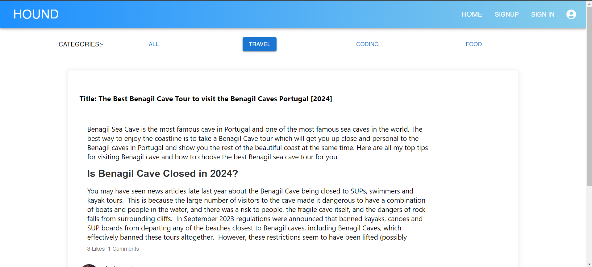
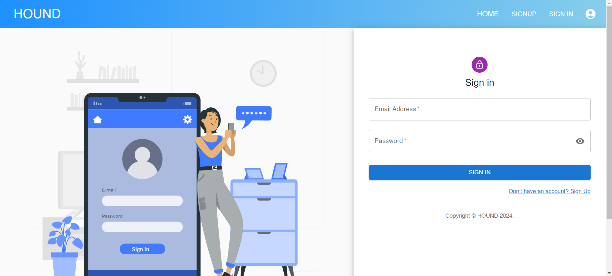
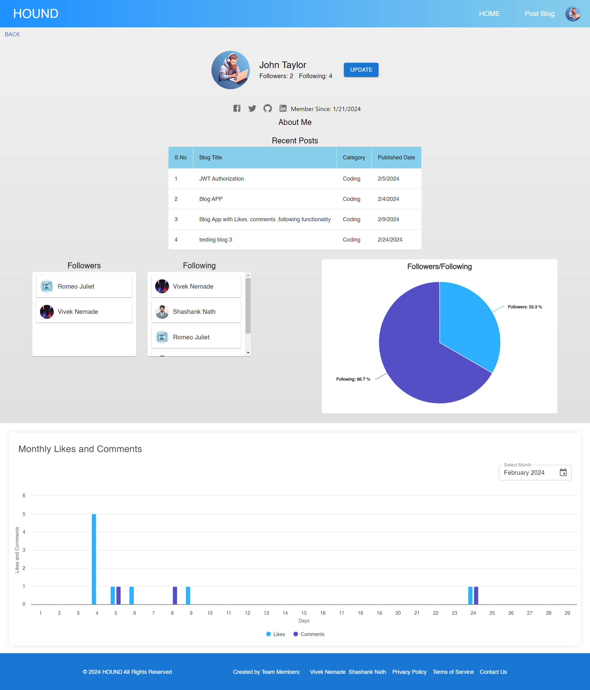
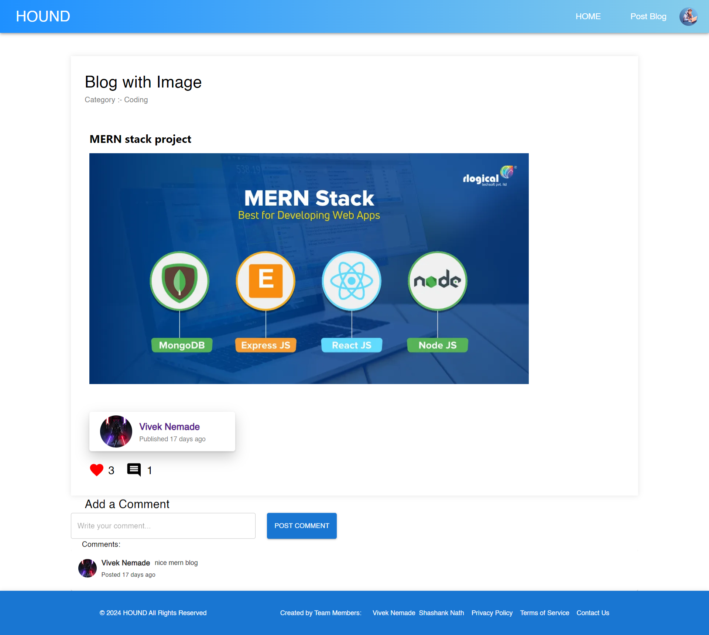
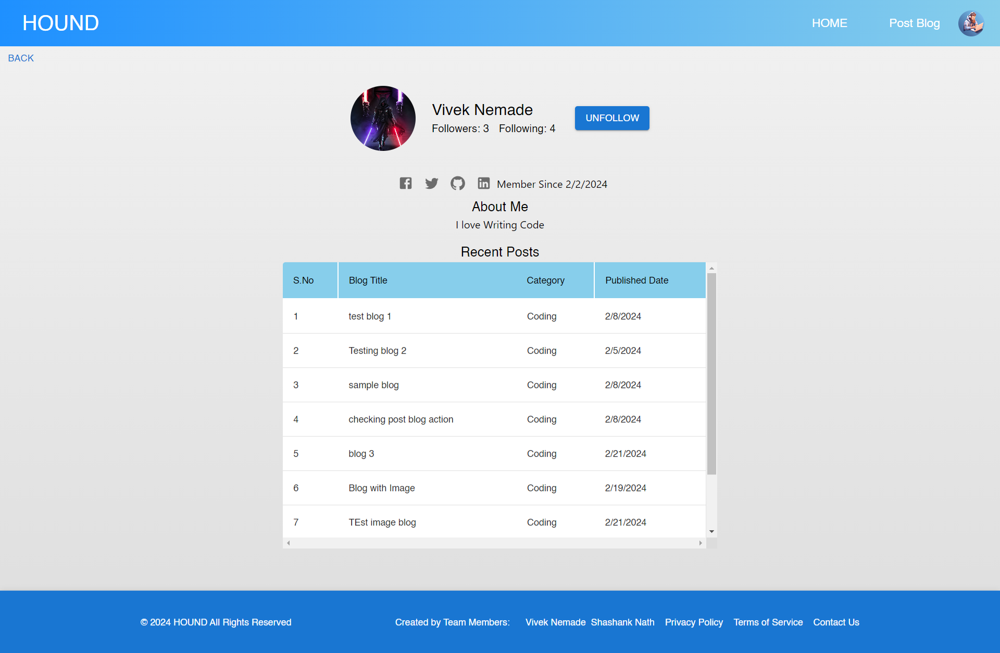
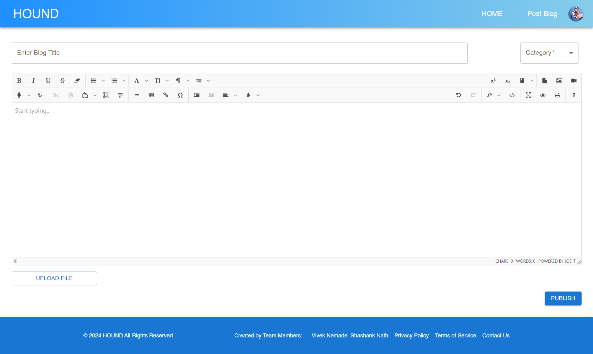
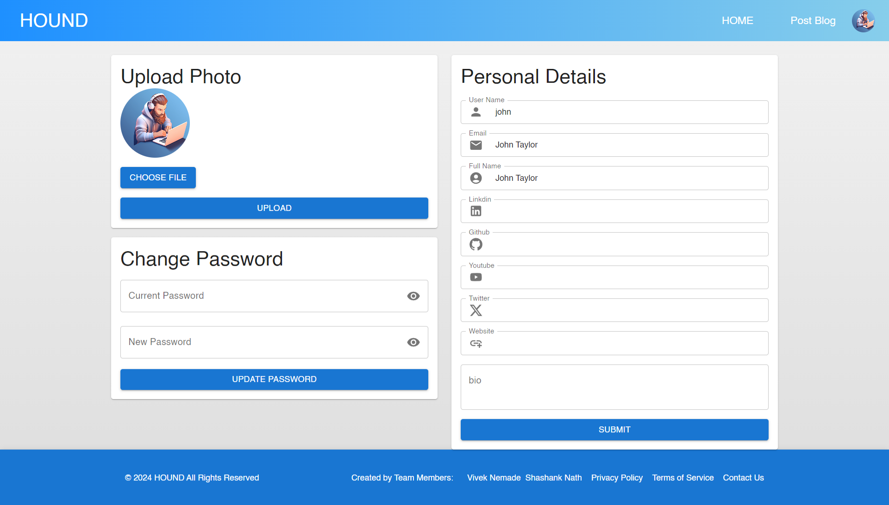

# "Discover the World of HOUND: A MERN-Stack Blogging Platform for Your Adventures"

  

## Blogging Application
This is a full-stack shopping application built using MERN stack by a team of 2. The application loads data from a MongoDB database and displays them using **_React and MUI_** ( front-end ), **_NodeJs and ExpressJS_** ( back-end ).

## Tech Stack

- MongoDB
- Express.js
- ReactJS
- Node.js
- MUI

Here are screenshots that show the application in use.

 
<h2 align="center">Landing Page</h2>

The Home Page displays blogs of various categories with Options of filters.

 
<h2 align="center">Sign Up Page</h2>

Welcome to Our Sign Up page, 

 
<h2 align="center">Sign In Page</h2>

Welcome to Our Sign Ip page, 

 
<h2 align="center">Profile Page</h2>

This page displays Information about User's Blogs, Followers, Following, And Statistics of likes & comments 

 
<h2 align="center">Single Blog page</h2>

This page displays the full information of blog including category, Author. 
    User can Like and Comment on Blog

 
<h2 align="center">Visited Author page</h2>

This page displays the information of Author And his blogs. User can Follow Author 

 
<h2 align="center">Create Blog Page</h2>

This page displays the blog Editor. User can fill the information and can publish the blog

 
<h2 align="center">My account Page</h2>

In this page User can update Profile Image as well as Social media links.
User can change the password

## Team Members
- [Vivek Nemade](https://github.com/Vivek-Nemade)

- [Shashank Nath](https://github.com/shashankfeb16)

